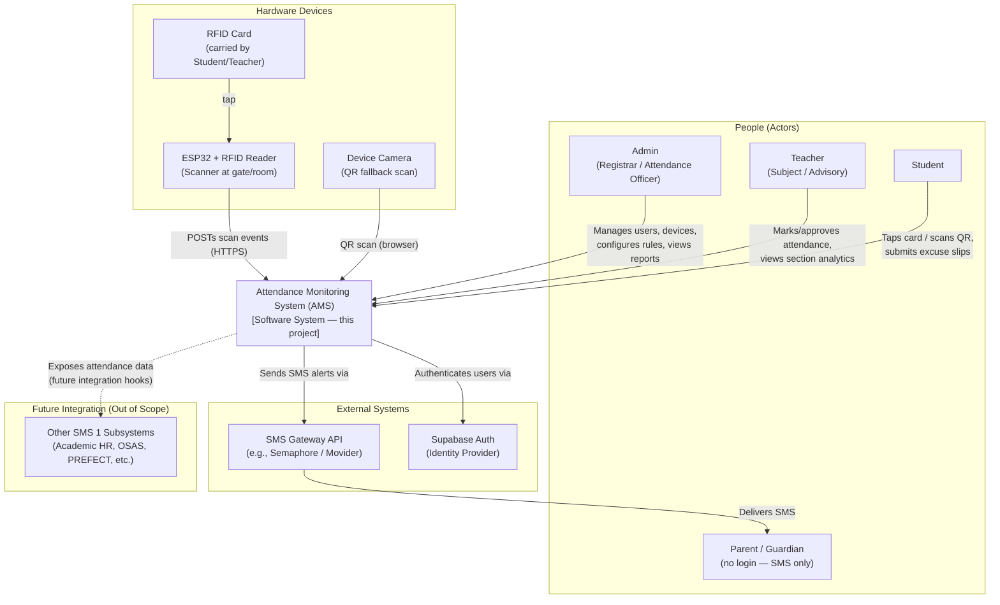

# System Context Document

## Attendance Monitoring System (AMS) — Bestlink College of the Philippines

**Companion to:** PRD.md, ARCHITECTURE.md, WORKFLOW.md
**Version:** 1.0
**Date:** September 25, 2026

---

## 1. Purpose

This document defines the **system context (C4 "Level 1")** for the AMS: what sits inside the system boundary, which people and external systems interact with it, and how those interactions flow. It answers "what is this system, who touches it, and what does it talk to?" before ARCHITECTURE.md goes into how it's built internally.

---

## 2. System Boundary Statement

The **Attendance Monitoring System (AMS)** is a web-based subsystem of the larger SMS 1 (School Management System) being developed for Bestlink College of the Philippines. It is responsible for capturing, classifying, storing, and reporting student and teacher attendance, and for notifying parents/guardians of attendance events. It is developed and scoped as a **standalone capstone module** with defined integration points for future SMS 1 subsystems, but those other subsystems are **outside** the AMS system boundary for this project.

---

## 3. System Context Diagram (C4 Level 1)

---

## 4. Actors

| Actor | Type | Description | Interaction with AMS |
|-------|------|--------------|-----------------------|
| **Admin** | Primary (Human, authenticated) | Registrar / attendance officer / system administrator | Full system configuration and oversight via Admin Panel |
| **Teacher** | Primary (Human, authenticated) | Subject/advisory teacher | Attendance marking, excuse slip review, section analytics via Teacher Panel |
| **Student** | Primary (Human, authenticated) | Enrolled student | Attendance scanning, personal history, excuse slip submission via Student Panel |
| **Parent/Guardian** | Secondary (Human, unauthenticated) | Linked to a student's profile by mobile number only | Receives SMS notifications; no direct system access |

---

## 5. External Systems & Dependencies

| External System | Direction | Purpose | Notes |
|------------------|-----------|---------|-------|
| **Supabase Auth** | AMS → depends on | User authentication, session/JWT issuance | Also backs RBAC role checks and RLS via `auth.uid()` |
| **SMS Gateway API** (e.g., Semaphore, Movider) | AMS → external | Sends SMS alerts to parents | Abstracted as a "notification service"; provider selected during implementation |
| **Supabase Realtime** | Internal to backend, treated as a platform capability | Live dashboard updates | Part of the Supabase platform, not a separate external system |
| **Supabase Storage** | Internal to backend | Stores excuse slip attachments | Part of the Supabase platform |
| **Other SMS 1 Subsystems** (Library, Clinic, Property Custodian, School Event, OSAS, PREFECT, Academic HR, Financial, Alumni) | Future — AMS exposes data | Long-term integration (e.g., Academic HR consuming teacher attendance; OSAS/PREFECT correlating incidents with attendance) | **Out of scope** for this capstone; represented only as an integration boundary |

---

## 6. Hardware Devices in Context

| Device | Role | Boundary |
|--------|------|----------|
| **ESP32 + RFID Reader (MFRC522)** | Primary attendance capture device, installed at gates/entrances/rooms | Outside the web system boundary, but tightly coupled via the `scan-ingest` API; treated as a first-class client of AMS |
| **RFID Card** | Physical credential carried by student/teacher | Passive — read by the ESP32, not a networked actor |
| **Device Camera (student's phone/laptop/kiosk)** | QR scan fallback | Uses the AMS web app itself (`/shared/qr-scan.html`), not a separate system |

---

## 7. In Scope vs. Out of Scope

### In Scope (AMS system boundary)
- Admin, Teacher, and Student web panels
- RFID/QR scan ingestion and classification logic
- Attendance logs, summaries, and calendar views
- Excuse slip submission/approval workflow
- SMS alert dispatch (via external gateway)
- Analytics dashboard and Perfect Attendance Award computation
- CSV/Excel export
- RBAC/RLS-based authorization

### Out of Scope
- Full functionality of the other nine SMS 1 subsystems
- Payroll processing (future Academic HR Management concern)
- Native mobile applications
- Parent-facing login/dashboard (SMS-only by design)
- SMS gateway's internal delivery infrastructure (treated as a black-box external dependency)

---

## 8. Assumptions Affecting Context

- Each ESP32 scanner has reliable Wi-Fi at its installation point.
- The school provides/maintains the physical network infrastructure for scanner devices.
- An SMS gateway account/API credentials will be provisioned by the school or project team before the alerting workflow can go live.
- Supabase Cloud (or a self-hosted equivalent) is the assumed backend platform for both development and production.
