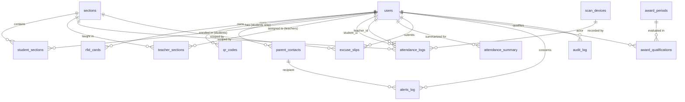

# Data Dictionary

## Attendance Monitoring System (AMS) — Bestlink College of the Philippines

**Companion to:** PRD.md, ARCHITECTURE.md, WORKFLOW.md, CONTEXT.md
**Version:** 1.0
**Date:** September 25, 2026
**Database:** Supabase (PostgreSQL)

---

## 1. Purpose

This document is the authoritative data dictionary for the AMS. It describes every table, field, type, constraint, and relationship defined in ARCHITECTURE.md §4, along with enumerations and the entity-relationship overview. Use this as the reference during migration development and code review.

---

## 2. Entity-Relationship Overview

---

## 3. Table Reference

### 3.1 `users`
Central identity table for all authenticated roles. Mirrors/extends `auth.users` (Supabase Auth).

| Column | Type | Constraints | Description |
|--------|------|-------------|-------------|
| `id` | `uuid` | PK, FK → `auth.users(id)`, `on delete cascade` | Matches the Supabase Auth user ID |
| `role` | `text` | `not null`, check in (`admin`,`teacher`,`student`) | RBAC role |
| `first_name` | `text` | `not null` | |
| `last_name` | `text` | `not null` | |
| `email` | `text` | `unique` | Login email |
| `student_number` | `text` | `unique`, nullable | Populated only for students |
| `employee_number` | `text` | `unique`, nullable | Populated only for teachers/admins |
| `status` | `text` | `not null`, default `active`, check in (`active`,`inactive`) | Enrollment/employment status |
| `created_at` | `timestamptz` | `not null`, default `now()` | |

**Notes:** Deactivating a user sets `status = 'inactive'` rather than deleting the row, to preserve historical attendance data integrity.

---

### 3.2 `parent_contacts`
Stores parent/guardian mobile numbers linked to a student. **Not** an authenticated identity — no role, no login.

| Column | Type | Constraints | Description |
|--------|------|-------------|-------------|
| `id` | `uuid` | PK, default `gen_random_uuid()` | |
| `student_id` | `uuid` | FK → `users(id)`, `on delete cascade` | Must reference a user with `role = 'student'` (enforced at application layer) |
| `full_name` | `text` | `not null` | |
| `relationship` | `text` | nullable | e.g. "Mother", "Father", "Guardian" |
| `mobile_number` | `text` | `not null` | SMS destination |
| `is_primary` | `boolean` | `not null`, default `true` | Primary contact receives all alerts by default |
| `created_at` | `timestamptz` | `not null`, default `now()` | |

---

### 3.3 `sections`
Class sections/groups students and teachers are organized into.

| Column | Type | Constraints | Description |
|--------|------|-------------|-------------|
| `id` | `uuid` | PK, default `gen_random_uuid()` | |
| `name` | `text` | `not null` | e.g. "BSIT 3-1" |
| `grade_level` | `text` | nullable | |
| `school_year` | `text` | `not null` | e.g. "2026-2027" |
| `created_at` | `timestamptz` | `not null`, default `now()` | |

---

### 3.4 `student_sections` (junction table)

| Column | Type | Constraints | Description |
|--------|------|-------------|-------------|
| `student_id` | `uuid` | PK part, FK → `users(id)`, `on delete cascade` | |
| `section_id` | `uuid` | PK part, FK → `sections(id)`, `on delete cascade` | |

---

### 3.5 `teacher_sections` (junction table)
Also used by RLS (`teacher_section_ids()` helper) to scope teacher access.

| Column | Type | Constraints | Description |
|--------|------|-------------|-------------|
| `teacher_id` | `uuid` | PK part, FK → `users(id)`, `on delete cascade` | |
| `section_id` | `uuid` | PK part, FK → `sections(id)`, `on delete cascade` | |
| `subject` | `text` | PK part, nullable | A teacher may teach multiple subjects in the same section |

---

### 3.6 `rfid_cards`

| Column | Type | Constraints | Description |
|--------|------|-------------|-------------|
| `id` | `uuid` | PK, default `gen_random_uuid()` | |
| `card_uid` | `text` | `unique`, `not null` | Hex UID read from the physical RFID card |
| `user_id` | `uuid` | `not null`, FK → `users(id)`, `on delete cascade` | |
| `is_active` | `boolean` | `not null`, default `true` | Deactivated instead of deleted if a card is lost/replaced |
| `issued_at` | `timestamptz` | `not null`, default `now()` | |

---

### 3.7 `qr_codes`

| Column | Type | Constraints | Description |
|--------|------|-------------|-------------|
| `id` | `uuid` | PK, default `gen_random_uuid()` | |
| `code_value` | `text` | `unique`, `not null` | Opaque encoded token (not the raw `user_id`, for security) |
| `user_id` | `uuid` | `not null`, FK → `users(id)`, `on delete cascade` | |
| `is_active` | `boolean` | `not null`, default `true` | |
| `issued_at` | `timestamptz` | `not null`, default `now()` | |

---

### 3.8 `scan_devices`
Registry of ESP32 scanner hardware.

| Column | Type | Constraints | Description |
|--------|------|-------------|-------------|
| `id` | `uuid` | PK, default `gen_random_uuid()` | |
| `device_code` | `text` | `unique`, `not null` | Human-readable ID, e.g. "GATE-01-ESP32" |
| `location` | `text` | nullable | Physical placement description |
| `api_key_hash` | `text` | `not null` | Hashed device authentication token |
| `last_heartbeat` | `timestamptz` | nullable | Updated by device ping every 60s |
| `status` | `text` | `not null`, default `offline`, check in (`online`,`offline`) | Derived from heartbeat recency |
| `created_at` | `timestamptz` | `not null`, default `now()` | |

---

### 3.9 `attendance_logs`
Raw, immutable scan/manual attendance events. The system of record for every individual tap or manual entry.

| Column | Type | Constraints | Description |
|--------|------|-------------|-------------|
| `id` | `uuid` | PK, default `gen_random_uuid()` | |
| `student_id` | `uuid` | FK → `users(id)`, `on delete cascade`, nullable | Null when the record is a teacher's own attendance |
| `teacher_id` | `uuid` | FK → `users(id)`, `on delete cascade`, nullable | Null when the record is a student's attendance |
| `section_id` | `uuid` | FK → `sections(id)`, nullable | Class/period context, where applicable |
| `device_id` | `uuid` | FK → `scan_devices(id)`, nullable | Null for manual/QR-only entries without a registered device |
| `scan_method` | `text` | `not null`, check in (`rfid`,`qr`,`manual`) | |
| `event_type` | `text` | `not null`, check in (`time_in`,`time_out`) | |
| `status` | `text` | check in (`present`,`late`,`absent`,`excused`) | Computed at insert/update time |
| `scanned_at` | `timestamptz` | `not null`, default `now()` | Actual event time (from device or manual entry) |
| `created_by` | `uuid` | FK → `users(id)`, nullable | Set only for manual entries (teacher/admin who entered it) |
| — | — | CHECK: `student_id is not null or teacher_id is not null` | Every row belongs to exactly one type of subject |

**Indexes:** `idx_attendance_student_date (student_id, scanned_at)`, `idx_attendance_teacher_date (teacher_id, scanned_at)`

---

### 3.10 `attendance_summary`
Pre-aggregated, one-row-per-user-per-day status used for fast analytics, calendar views, and award computation.

| Column | Type | Constraints | Description |
|--------|------|-------------|-------------|
| `id` | `uuid` | PK, default `gen_random_uuid()` | |
| `user_id` | `uuid` | `not null`, FK → `users(id)`, `on delete cascade` | Student or teacher |
| `summary_date` | `date` | `not null` | |
| `status` | `text` | `not null`, check in (`present`,`late`,`absent`,`excused`,`holiday`) | Final status of record |
| `minutes_late` | `int` | default `0` | Populated when `status = 'late'` |
| — | — | UNIQUE (`user_id`, `summary_date`) | One summary row per user per day |

---

### 3.11 `holidays` & `academic_schedules`

#### `holidays`
| Column | Type | Constraints | Description |
|--------|------|-------------|-------------|
| `id` | `uuid` | PK, default `gen_random_uuid()` | Primary Key |
| `holiday_date` | `date` | `unique`, `not null` | Legal holiday date |
| `description` | `text` | nullable | Holiday name / proclamation |

#### `academic_schedules` (Multi-Role Calendar Events)
| Column | Type | Constraints | Description |
|--------|------|-------------|-------------|
| `id` | `uuid` | PK, default `gen_random_uuid()` | Primary Key |
| `title` | `text` | `not null` | Event or non-class title |
| `schedule_type` | `text` | `not null`, check in (`holiday`,`no_classes`,`school_event`,`suspension`,`exam_week`) | Classification of calendar entry |
| `start_date` | `date` | `not null` | Effective start date |
| `end_date` | `date` | `not null` | Effective end date |
| `description` | `text` | nullable | Details or administrative notes |
| `affected_scope` | `text` | `not null`, default `'all'`, check in (`all`,`college`,`shs`,`faculty_only`) | Scope of affected participants |
| `created_by` | `uuid` | FK → `users(id)`, nullable | Administrator who registered the schedule |
| `created_at` | `timestamptz` | default `now()`, `not null` | Record creation timestamp |

---

### 3.12 `excuse_slips`

| Column | Type | Constraints | Description |
|--------|------|-------------|-------------|
| `id` | `uuid` | PK, default `gen_random_uuid()` | |
| `student_id` | `uuid` | `not null`, FK → `users(id)`, `on delete cascade` | |
| `section_id` | `uuid` | FK → `sections(id)`, nullable | |
| `date_from` | `date` | `not null` | |
| `date_to` | `date` | `not null` | |
| `reason` | `text` | `not null` | |
| `attachment_url` | `text` | nullable | Path in Supabase Storage |
| `status` | `text` | `not null`, default `pending`, check in (`pending`,`approved`,`rejected`) | |
| `reviewed_by` | `uuid` | FK → `users(id)`, nullable | Teacher/Admin who reviewed |
| `reviewed_at` | `timestamptz` | nullable | |
| `created_at` | `timestamptz` | `not null`, default `now()` | |

---

### 3.13 `alerts_log`
Record of every SMS notification attempted.

| Column | Type | Constraints | Description |
|--------|------|-------------|-------------|
| `id` | `uuid` | PK, default `gen_random_uuid()` | |
| `student_id` | `uuid` | FK → `users(id)`, `on delete cascade`, nullable | |
| `parent_contact_id` | `uuid` | FK → `parent_contacts(id)`, nullable | Recipient |
| `channel` | `text` | `not null`, default `sms` | Reserved for future channels |
| `message` | `text` | `not null` | Rendered message body |
| `status` | `text` | `not null`, default `pending`, check in (`pending`,`sent`,`failed`) | |
| `sent_at` | `timestamptz` | nullable | |
| `created_at` | `timestamptz` | `not null`, default `now()` | |

---

### 3.14 `award_periods`

| Column | Type | Constraints | Description |
|--------|------|-------------|-------------|
| `id` | `uuid` | PK, default `gen_random_uuid()` | |
| `name` | `text` | `not null` | e.g. "1st Semester 2026-2027" |
| `start_date` | `date` | `not null` | |
| `end_date` | `date` | `not null` | |
| `max_allowed_excused` | `int` | `not null`, default `0` | Excused absences still allowed to qualify |

---

### 3.15 `award_qualifications`

| Column | Type | Constraints | Description |
|--------|------|-------------|-------------|
| `id` | `uuid` | PK, default `gen_random_uuid()` | |
| `period_id` | `uuid` | FK → `award_periods(id)`, `on delete cascade` | |
| `user_id` | `uuid` | FK → `users(id)`, `on delete cascade` | |
| `qualified` | `boolean` | `not null` | Computed result |
| `computed_at` | `timestamptz` | `not null`, default `now()` | |
| — | — | UNIQUE (`period_id`, `user_id`) | One evaluation per user per period |

---

### 3.16 `audit_log`
Immutable log of sensitive/administrative actions (manual overrides, exports, unregistered card attempts, etc.)

| Column | Type | Constraints | Description |
|--------|------|-------------|-------------|
| `id` | `uuid` | PK, default `gen_random_uuid()` | |
| `actor_id` | `uuid` | FK → `users(id)`, nullable | Null for system/service actions |
| `action` | `text` | `not null` | e.g. `manual_override`, `export_generated`, `unregistered_card` |
| `table_name` | `text` | nullable | Affected table, if applicable |
| `record_id` | `uuid` | nullable | Affected row ID, if applicable |
| `details` | `jsonb` | nullable | Freeform structured context |
| `created_at` | `timestamptz` | `not null`, default `now()` | |

---

## 4. Enumerated Values Reference

| Field | Table | Allowed Values |
|-------|-------|-----------------|
| `role` | `users` | `admin`, `teacher`, `student` |
| `status` (enrollment) | `users` | `active`, `inactive` |
| `status` (device) | `scan_devices` | `online`, `offline` |
| `scan_method` | `attendance_logs` | `rfid`, `qr`, `manual` |
| `event_type` | `attendance_logs` | `time_in`, `time_out` |
| `status` (attendance) | `attendance_logs`, `attendance_summary` | `present`, `late`, `absent`, `excused` (+ `holiday` in `attendance_summary` only) |
| `status` (excuse slip) | `excuse_slips` | `pending`, `approved`, `rejected` |
| `status` (alert) | `alerts_log` | `pending`, `sent`, `failed` |
| `channel` | `alerts_log` | `sms` (reserved for future expansion) |

---

## 5. Data Retention & Integrity Notes

- **Soft deletion preferred:** `users`, `rfid_cards`, `qr_codes` use `is_active`/`status` flags rather than hard deletes, to preserve referential integrity of historical `attendance_logs`.
- **`attendance_logs` is append-only** in normal operation; corrections are made via new rows or the manual override RPC, never by editing/deleting historical scan records, to preserve audit integrity.
- **`attendance_summary` is derived data** — it can be safely recomputed from `attendance_logs` + `excuse_slips` + `holidays` if ever out of sync.
- **Personal data (student/parent info)** falls under the Philippine Data Privacy Act (RA 10173); access is restricted via RLS per role, and `parent_contacts.mobile_number` should be treated as sensitive PII in application logs.

---

## 6. Cross-Reference

- Table definitions (DDL): see **ARCHITECTURE.md §4**
- RLS policy logic per table: see **ARCHITECTURE.md §5** and **PRD.md §6.5**
- Which workflow writes/reads each table: see **WORKFLOW.md**
- System/external boundary for this data: see **CONTEXT.md**
