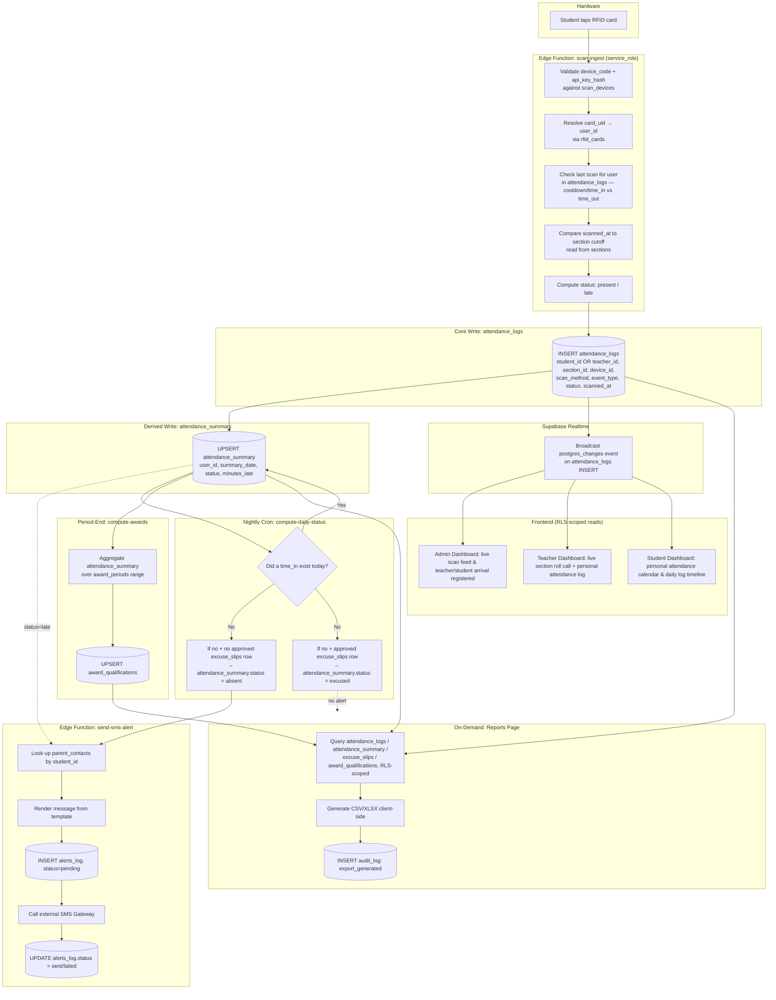

# End-to-End Database Workflow

## Attendance Monitoring System (AMS) — Bestlink College of the Philippines

**Companion to:** PRD.md, ARCHITECTURE.md, DATA.md, MODULE_WORKFLOWS.md
**Version:** 1.0
**Date:** September 25, 2026

---

## 1. Purpose

This document traces a **single scan event end-to-end through every table it touches**, from the physical RFID tap to the final exported report — the full lifecycle of one piece of attendance data across the entire database. Use it to validate that migrations, triggers, and cron jobs are wired correctly, and as the reference when writing integration tests.

---

## 2. Full End-to-End Flow (One Scan's Life)

---

## 3. Table Lifecycle Reference

The table below shows, for **every table in the schema**, which process writes to it, which reads from it, and where it sits in the end-to-end flow above.

| Table | Written by | Read by | Stage in E2E flow |
|---|---|---|---|
| `scan_devices` | Admin (registration), device heartbeat ping | `scan-ingest` (validation) | Pre-flight — validates the hardware source |
| `rfid_cards` / `qr_codes` | Admin (issuance) | `scan-ingest` (identity resolution) | Ingestion step I2 |
| `sections` | Admin (setup) | `scan-ingest` (cutoff time), dashboards, exports | Ingestion step I4; read throughout |
| `attendance_logs` | `scan-ingest` (INSERT), manual override RPC | Dashboards, calendar drill-down, exports, Realtime source | **Core write** — system of record |
| `attendance_summary` | `scan-ingest` path (UPSERT), `compute-daily-status` cron | Dashboards, calendar, awards, exports | **Derived write** — fast-read aggregate |
| `holidays` | Admin (setup) | `compute-daily-status` (skip logic) | Nightly cron decision input |
| `excuse_slips` | Student (INSERT), Teacher/Admin (UPDATE status) | `compute-daily-status` (excused check), calendar | Feeds nightly classification |
| `parent_contacts` | Admin/Student profile management | `send-sms-alert` | Alerting step A1 |
| `alerts_log` | `send-sms-alert` (INSERT/UPDATE) | Admin (delivery monitoring) | Alerting steps A3–A5 |
| `award_periods` | Admin (setup) | `compute-awards` | Period-end input |
| `award_qualifications` | `compute-awards` (UPSERT) | Admin (award list), exports | Period-end output |
| `audit_log` | `scan-ingest` (rejections), manual overrides, exports | Admin (audit review) | Cross-cutting — written at multiple stages |
| `users` | Admin (provisioning), Supabase Auth (identity) | Every table via FK / RLS role checks | Cross-cutting — identity backbone |

---

## 4. End-to-End Timing Model

| Stage | Typical latency | Trigger type |
|---|---|---|
| Tap → `attendance_logs` insert | < 2 seconds | Synchronous (Edge Function) |
| Insert → Realtime dashboard update | < 1 second | Event-driven (Supabase Realtime) |
| Late scan → SMS queued | Near-immediate (same request or async follow-up) | Event-driven |
| SMS queued → delivered | Seconds to ~1 minute | Dependent on external SMS gateway |
| Absence classification | Once nightly (e.g., 8:00 PM) | Scheduled (cron) |
| Award qualification | End of grading period/semester, or on-demand | Scheduled or Admin-triggered |
| Export generation | On-demand, sub-second to a few seconds depending on row count | User-initiated |

---

## 5. Consistency & Recovery Notes

- **`attendance_summary` is fully derivable** from `attendance_logs` + `excuse_slips` + `holidays`. If it ever drifts out of sync (e.g., after a bulk manual correction), it can be safely truncated and rebuilt by re-running the nightly classification logic across the affected date range — no data loss, since `attendance_logs` remains the immutable source of truth.
- **`award_qualifications` is fully derivable** from `attendance_summary` for a given `award_periods` range — safe to recompute at any time via `compute-awards`.
- **`alerts_log` is append/update-only** and never recomputed — it is the permanent record of what was actually attempted/sent, independent of later data corrections (e.g., an approved excuse slip after the fact does not retroactively delete the "Absent" SMS that was already sent that night — this is intentional, matching real-world notification behavior).
- **A single scan event can fan out to multiple tables** (`attendance_logs` → `attendance_summary` → `alerts_log` → eventually `award_qualifications` and `audit_log` at export time), but only `attendance_logs` is the append-only source; everything downstream is either derived or a log of an external action.
