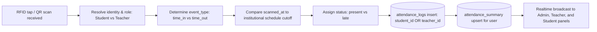
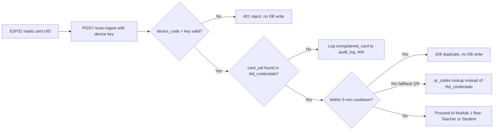
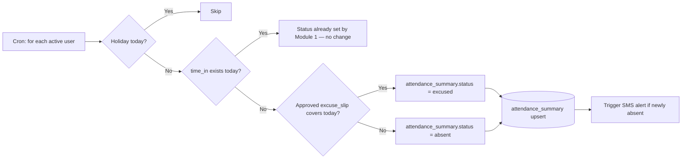
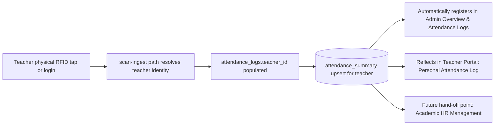
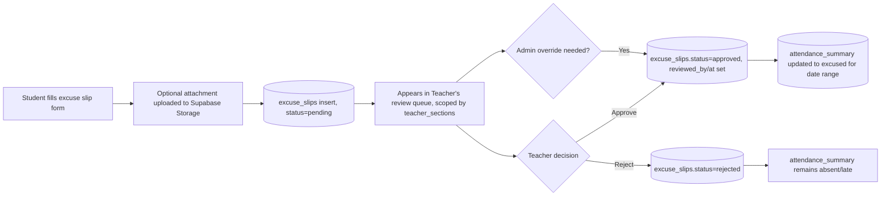
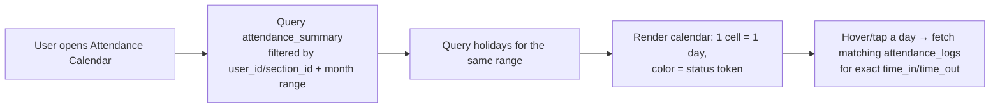
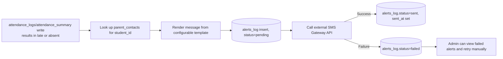
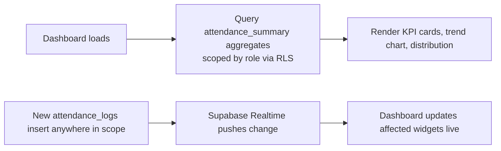
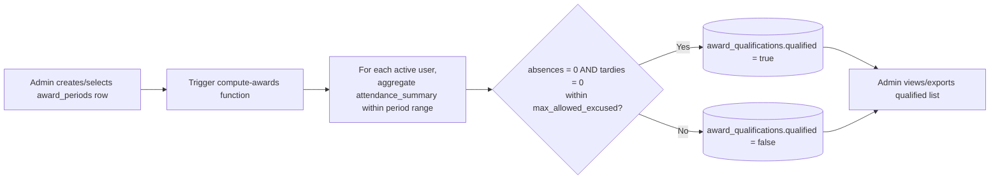
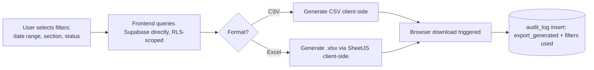

# Module-by-Module Workflow

## Attendance Monitoring System (AMS) — Bestlink College of the Philippines

**Companion to:** PRD.md, ARCHITECTURE.md, WORKFLOW.md, CONTEXT.md, DATA.md, UI_UX_ARCHITECTURE.md
**Version:** 1.0
**Date:** September 25, 2026

---

## 1. Purpose

WORKFLOW.md covers cross-cutting, system-wide flows. This document breaks the AMS down **module by module** (matching the 10 modules in the PRD) and, for each one, defines: the actors involved, the trigger, the step-by-step flow, the tables touched, and the exit/output state. Use this as the implementation checklist per module.

---

## 2. Module 1 — Daily Attendance Marking

**Actors:** Student, Teacher, ESP32 Hardware Scanner, System (cron).
**Trigger:** Physical RFID card tap on reader, QR camera fallback scan, or manual entry.

**Real-World Operational Behavior:**
* **Teachers:** When a teacher scans in at the physical RFID reader, their attendance status (Present or Late based on schedule cutoff) automatically registers in the Admin system. The teacher also has access to their personal attendance log in their Teacher Portal (`/teacher/`) to keep track of their check-in/time-out history.
* **Students:** When students tap their RFID card on the scanner, a real-time record is generated indicating whether they are Present or Late. The status updates Admin live feeds, Teacher section roll calls, and the student's personal calendar in the Student Portal (`/student/`).
* **Both Stakeholders:** Both teachers and students have dedicated access to attendance logs in their respective portals to keep track of their personal attendance.

**Tables touched:** `attendance_logs` (insert), `attendance_summary` (upsert), `users` (read identity and role), `system_settings` (read cutoff times).
**Exit state:** One immutable log row + one updated daily summary row per user per day.

---

## 3. Module 2 — RFID/QR Scanning

**Actors:** Student/Teacher (physical tap/scan), ESP32 device, System.
**Trigger:** Physical RFID tap at ESP32 MFRC522 scanner, or QR code scanned via `/shared/qr-scan.html`.

**Tables touched:** `scan_devices` (read, validate), `rfid_credentials` / `qr_codes` (read, resolve identity), `audit_log` (insert, on rejection), then hands off to Module 1's `attendance_logs`/`attendance_summary`.
**Exit state:** Either a valid attendance event (Module 1 takes over) or a logged rejection with no attendance record created.
**Device health side-flow:** ESP32 also pings a heartbeat every 60s → updates `scan_devices.last_heartbeat`/`status`, independent of scan events.

---

## 4. Module 3 — Tardy & Absence Logs

**Actors:** System (cron), Admin/Teacher (viewing).
**Trigger:** Nightly `compute-daily-status` cron; or an Admin/Teacher opening the Tardy & Absence Logs screen.

**Tables touched:** `attendance_summary` (read/upsert), `excuse_slips` (read, approved only), `holidays` (read).
**Exit state:** Every active user has exactly one finalized `attendance_summary` row for the day; the Tardy & Absence Logs screen queries this table filtered to `status in (late, absent)`.

---

## 5. Module 4 — Teacher Attendance

**Actors:** Teacher, ESP32 Hardware Reader, Admin System.
**Trigger:** Teacher taps their physical RFID card at the scanner, or logs in and marks manually.

**Operational Contract & Scenarios:**
1. **Automatic Admin Registration:** When teachers scan in with their RFID card, their attendance status (Present or Late based on schedule cutoff) automatically registers in the Admin system in real time.
2. **Personal Teacher Tracking:** In addition to viewing their assigned sections, the teacher panel provides a dedicated **Personal Attendance Log** where teachers track their own time-in, time-out, and punctuality rate.
3. **Structured for Hand-Off:** Structured cleanly to facilitate future hand-off to the Academic HR subsystem without database schema changes.

**Tables touched:** Same as Module 1, using `teacher_id` instead of `student_id` (mutually exclusive per the `attendance_logs` check constraint).
**Exit state:** Teacher attendance is tracked seamlessly via physical RFID, visible live in Admin, and tracked personally in the Teacher Portal.

---

## 6. Module 5 — Excuse Slip Submission

**Actors:** Student (submit), Teacher (review), Admin (override).
**Trigger:** Student submits a slip for a past/upcoming absence.

**Tables touched:** `excuse_slips` (insert/update), `attendance_summary` (update on approval), Supabase Storage (attachment).
**Exit state:** A slip in a terminal state (`approved`/`rejected`); if approved, the affected day(s) in `attendance_summary` reflect `excused`.

---

## 7. Module 6 — Attendance Calendar

**Actors:** Student, Teacher, Admin (read-only view module — writes nothing).
**Trigger:** User opens the calendar view.

**Tables touched:** `attendance_summary` (read), `holidays` (read), `attendance_logs` (read, drill-down only).
**Exit state:** Read-only visualization; no data mutation. RLS scopes results automatically per role (student sees own, teacher sees their sections, admin sees all).

---

## 8. Module 7 — Alerts to Parents

**Actors:** System (triggered by Modules 1 & 3), external SMS gateway.
**Trigger:** A `late` scan event, or a nightly-computed `absent` status.

**Tables touched:** `parent_contacts` (read), `alerts_log` (insert/update).
**Exit state:** Every alert attempt has a permanent audit trail in `alerts_log`, regardless of delivery success.

---

## 9. Module 8 — Analytics Dashboard

**Actors:** Admin, Teacher, Student (read-only, scoped differently per role).
**Trigger:** User opens their dashboard; also refreshed by Realtime events.

**Tables touched:** `attendance_summary` (primary read source for speed), `attendance_logs` (Realtime trigger source), `sections` (grouping).
**Exit state:** No writes; a continuously live view. Admin sees institution-wide, Teacher sees own sections, Student sees personal history only — enforced by RLS, not just UI filtering.

---

## 10. Module 9 — Perfect Attendance Award Tool

**Actors:** Admin (configure/trigger), System (compute).
**Trigger:** Admin defines an `award_periods` row and runs (or schedules) `compute-awards`.

**Tables touched:** `award_periods` (read), `attendance_summary` (aggregate read), `award_qualifications` (insert/update).
**Exit state:** A finalized, exportable qualification list per award period, usable for certificate generation.

---

## 11. Module 10 — CSV/Excel Export

**Actors:** Admin, Teacher.
**Trigger:** User applies filters on the Reports page and clicks Export.

**Tables touched:** Any table relevant to the report (`attendance_logs`, `attendance_summary`, `excuse_slips`, `award_qualifications` — read-only), `audit_log` (insert).
**Exit state:** A downloaded file in the user's browser and a permanent audit record of what was exported, by whom, and with which filters.

---

## 12. Module Dependency Summary

| Module | Depends on | Feeds into |
|---|---|---|
| 1. Daily Attendance Marking | Module 2 (or manual fallback) | Modules 3, 6, 7, 8 |
| 2. RFID/QR Scanning | Hardware (ESP32/RFID/QR) | Module 1 |
| 3. Tardy & Absence Logs | Module 1, Module 5 (excuse slips) | Module 7, 8, 9 |
| 4. Teacher Attendance | Module 2 (or manual) | Future Academic HR integration |
| 5. Excuse Slip Submission | Module 3 (status context) | Module 3 (updates), Module 6 |
| 6. Attendance Calendar | Modules 1, 3, 5 | Read-only, terminal |
| 7. Alerts to Parents | Modules 1, 3 | Read-only, terminal (`alerts_log`) |
| 8. Analytics Dashboard | Modules 1, 3 | Read-only, terminal |
| 9. Perfect Attendance Award | Module 3 (finalized summaries) | Read-only + `award_qualifications` |
| 10. CSV/Excel Export | Any of the above | Read-only, terminal + `audit_log` |
