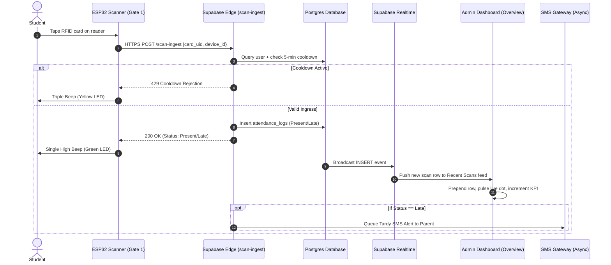

# UI/UX Architecture Document

## Attendance Monitoring System (AMS) — Bestlink College of the Philippines
**Subsystem of SMS 1 (School Management System)**  
**Companion Documents:** `PRD.md`, `ARCHITECTURE.md`, `WORKFLOW.md`, `DATA.md`, `UI-UX_BackendSpec.md`  
**Version:** 1.0  
**Date:** September 26, 2026  
**Status:** Approved Architecture Specification  

---

## 1. Executive Summary & Design Vision

The **Attendance Monitoring System (AMS)** is a mission-critical web application and hardware ecosystem engineered for Bestlink College of the Philippines. Operating as a standalone capstone module within the SMS 1 enterprise ecosystem, AMS unifies **automated hardware ingestion (ESP32 RFID & camera QR scanning)** with **executive-grade performance analytics** and **real-time stakeholder alerting**.

```
       HIGH VELOCITY INGRESS                EXECUTIVE CONTROL & ANALYTICS           STAKEHOLDER VISIBILITY
┌─────────────────────────────────┐       ┌─────────────────────────────────┐      ┌─────────────────────────┐
│ • ESP32 RFID Gate Readers       │       │ • Realtime Admin Command Center │      │ • Teacher Section Tools │
│ • Dual-Camera QR Fallback       │ ────► │ • Rolling 5-Week Trend Visuals  │ ───► │ • Student Calendar/Apps │
│ • 5-Minute Anti-Passback Filter │       │ • Flagged Section Watchlists    │      │ • Parent Automated SMS │
└─────────────────────────────────┘       └─────────────────────────────────┘      └─────────────────────────┘
```

### 1.1 Core UX Tenets
1. **Sub-Second Cognitive Ingress:** Gate scanners and live log feeds provide immediate positive/negative feedback within <300ms (optical indicators, distinct auditory chimes, and instant dashboard real-time updates).
2. **Dense, Glancable Executive Dashboards:** Administrators and department heads can ascertain institutional attendance health, identify at-risk sections, and detect scanner hardware downtime in less than 3 seconds.
3. **Failsafe Tiered Fallbacks:** When RFID readers experience environmental downtime, users seamlessly transition to camera-based QR code scanning (`/shared/qr-scan.html`), followed by authenticated teacher manual overrides.
4. **Frictionless Administrative Governance:** Bulk excuse slip processing, automated status reconciliation, and automated one-click Perfect Attendance evaluation eliminate tedious paperwork.
5. **Unidirectional Asynchronous Parent Visibility:** Parents and guardians are kept continuously informed through automated SMS alerts without requiring portal logins.

---

## 2. Design System & Visual Language

The AMS visual design system is derived from the **Color Hunt Blue Palette** ([Palette Reference](https://colorhunt.co/palette/e3f2fd90caf92196f30d47a1)). The palette establishes an authoritative, collegiate, and modern enterprise look with high contrast and accessibility compliance.

### 2.1 Core Palette Tokens

| Token | Hex Code | Visual Role | Usage in Interface |
|---|---|---|---|
| `--ch-900` | `#0D47A1` | **Deep Royal Navy** | Primary brand mark, authoritative headings, high-contrast text, dark surface foundations, table headers |
| `--ch-500` | `#2196F3` | **Vibrant Primary Blue** | Interactive accents, active navigation indicators, primary CTA buttons, trend chart primary line, focus rings |
| `--ch-200` | `#90CAF9` | **Pastel Sky Blue** | Card borders, secondary targets in charts, focus outlines, subtle dividers, secondary text in dark mode |
| `--ch-100` | `#E3F2FD` | **Soft Ice Blue** | Light mode canvas backgrounds, card hover tints, avatar badges, pill backgrounds, metric card icon backdrops |

### 2.2 Semantic Status Palette
Attendance statuses require instant recognition across diverse lighting conditions:

| Status | Primary Color | Soft Tint (Background) | Text On Dark | Psychological Semantics |
|---|---|---|---|---|
| **Present** | `#10B981` (Emerald) | `rgba(16, 185, 129, 0.12)` | `#34D399` | On-time arrival, valid credential tap |
| **Late / Tardy** | `#F59E0B` (Amber) | `rgba(245, 158, 11, 0.12)` | `#FBBF24` | Scanned after section cutoff threshold |
| **Absent** | `#EF4444` (Crimson) | `rgba(239, 68, 68, 0.12)` | `#F87171` | Unaccounted absence; triggers parent SMS |
| **Excused** | `#0288D1` (Cerulean) | `rgba(2, 136, 209, 0.12)` | `#60A5FA` | Approved medical/official excuse slip |

### 2.3 Dual-Theme System Specification

The design system implements a dynamic CSS variable architecture supporting both a crisp enterprise **Light Theme** (default) and a low-glare **Midnight Navy Theme**:

```css
:root {
  /* Palette Constants */
  --ch-100: #E3F2FD;
  --ch-200: #90CAF9;
  --ch-500: #2196F3;
  --ch-900: #0D47A1;

  /* Light Theme (Authoritative Institutional Default) */
  --bg: #F4F8FC;
  --surface: #FFFFFF;
  --surface-hover: #F8FAFD;
  --raised: #E3F2FD;
  --border: #DCE8F5;
  --border-strong: #90CAF9;
  --text-1: #0D47A1;
  --text-2: #4A657E;
  --text-3: #829DB5;
  --accent: #2196F3;
  --accent-soft: rgba(33, 150, 243, 0.12);
  --card-shadow: 0 4px 20px -2px rgba(13, 71, 161, 0.06), 0 1px 4px 0 rgba(13, 71, 161, 0.04);
}

[data-theme="dark"] {
  /* Midnight Navy Theme (Control Rooms & Kiosks) */
  --bg: #071324;
  --surface: #0C1D38;
  --surface-hover: #102649;
  --raised: #132A4F;
  --border: #1A3866;
  --border-strong: #2196F3;
  --text-1: #E3F2FD;
  --text-2: #90CAF9;
  --text-3: #6282A8;
  --accent: #2196F3;
  --accent-soft: rgba(33, 150, 243, 0.22);
  --card-shadow: 0 6px 24px -2px rgba(0, 0, 0, 0.45);
}
```

### 2.4 Typography Hierarchy
The application leverages **Inter** with native browser fallbacks and tabular numeric alignments for audit logs and KPIs:

- **Display Numbers (KPI Values):** 26px / 700 weight / letter-spacing `-0.015em` / `tabular-nums`
- **Page Titles (`h1`):** 22px / 700 weight / letter-spacing `-0.015em`
- **Section Headers (`h3`):** 14px / 600 weight / color `--text-1`
- **Body Regular:** 13.5px / 400 & 500 weight / line-height `1.5`
- **Labels & Subtext:** 11.5px – 12px / 500 weight / color `--text-2`
- **Overline / Micro-tags:** 10.5px / 700 weight / letter-spacing `0.08em` / uppercase

---

## 3. Information Architecture (IA) & Route Taxonomy

AMS implements strict Role-Based Access Control (RBAC) separated into physical folder routes, preventing privilege leakage while preserving clean mental models.

```mermaid
flowchart TD
    Login["/index.html (Login Portal)"] --> Guard{"rbac-guard.js<br/>(Role Check)"}
    
    Guard -->|role = admin| AdminRoot["/admin/"]
    Guard -->|role = teacher| TeacherRoot["/teacher/"]
    Guard -->|role = student| StudentRoot["/student/"]
    
    subgraph AdminPanel["Admin Command Space"]
        AdminRoot --> A1["dashboard.html (Overview & Live Stream)"]
        AdminRoot --> A2["attendance-logs.html (Live Logs & Filters)"]
        AdminRoot --> A3["sections.html (Curriculum & Sections)"]
        AdminRoot --> A4["users.html (Student/Teacher Registry)"]
        AdminRoot --> A5["devices.html (ESP32 Gateway Hub)"]
        AdminRoot --> A6["excuse-slips.html (Review & Escalate)"]
        AdminRoot --> A7["analytics.html (Institutional BI)"]
        AdminRoot --> A8["awards.html (Perfect Attendance Tool)"]
        AdminRoot --> A9["reports.html (CSV / Excel Export)"]
        AdminRoot --> A10["settings.html (Schedules, SMS, Cutoffs)"]
    end
    
    subgraph TeacherPanel["Teacher Workspace"]
        TeacherRoot --> T1["dashboard.html (Today's Classes)"]
        TeacherRoot --> T2["attendance.html (Roll Call & Overrides)"]
        TeacherRoot --> T3["excuse-slips.html (Approve/Reject)"]
        TeacherRoot --> T4["analytics.html (Section Performance)"]
    end
    
    subgraph StudentPanel["Student Portal"]
        StudentRoot --> S1["dashboard.html (Summary & Today)"]
        StudentRoot --> S2["attendance-calendar.html (Color Grid)"]
        StudentRoot --> S3["excuse-slip-submit.html (File Upload)"]
        StudentRoot --> S4["analytics.html (My Rate & Warnings)"]
    end

    subgraph SharedSpace["Shared & Fallback Utility"]
        QR["/shared/qr-scan.html (Camera Fallback Scanner)"]
        Unauth["/shared/unauthorized.html"]
    end
```



---

## 4. Screen-by-Screen UX Specifications

### 4.1 Admin Overview Dashboard (`/admin/dashboard.html`)
- **App Bar Header:** Sticky frosted glass (`backdrop-filter: blur(12px)`), live WebSocket connection status, light/dark theme toggle, notification bell with unread badge, and administrative profile menu.
- **Top Metric Cards (KPI Quartet):**
  1. *Present Today:* Large integer display with live count-up animation, green delta pill showing week-over-week percentage change.
  2. *Attendance Rate:* Percentage gauge against college target (92%), color-coded status indicator.
  3. *Late Today:* Tardy counter with alert indicator highlighting students arriving past cutoff.
  4. *Absent Today:* Daily total unexcused absences with inverse trend indicators.
- **Trend Line Graph:** 5-week present rate curve with dual lines:
  - Solid electric blue curve (`#2196F3`) with vertical linear alpha gradient fill.
  - Dashed benchmark reference target line (`#0D47A1` or `#90CAF9`) at 92%.
  - Fully responsive Chart.js canvas with interactive floating tooltips.
- **Today's Distribution Bar Chart:** Stacked progress visualizer showing Present, Late, Absent, and Excused percentages totaling 100% of enrolled students.
- **Real-Time Recent Scans Feed:**
  - Micro avatar with user initials.
  - User full name, section, gate number, and scanning method (RFID vs. QR).
  - Relative timestamp with live pulsating green dot indicator.
  - Status pill chip with high-contrast text.
- **Sections to Watch (Risk Radar):** Ranked leaderboard displaying top sections with abnormal absence or tardiness rates, driving immediate intervention.

### 4.2 Scanner Terminal & Ingress Kiosk (`/shared/qr-scan.html` & Hardware)
- **Zero-Latency Ingress Screen:** High-contrast camera viewfinder viewport overlayed with alignment guide brackets.
- **Feedback Overlay:**
  - *Green Flash + Single Beep:* Scan accepted, Time-in recorded. Name and Section displayed for 2 seconds.
  - *Amber Flash + Double Beep:* Scan accepted as Late arrival. Cutoff time delta displayed.
  - *Yellow Strobe + Triple Beep:* Cooldown rejection (anti-passback within 5 minutes). Friendly warning: "Card already scanned".
  - *Red Flash + Error Buzzer:* Unregistered card or inactive student credential. "See Registrar" directive.

### 4.3 Digital Excuse Slip Portal
- **Student Submission Interface (`/student/excuse-slip-submit.html`):**
  - Drag-and-drop file uploader supporting medical certificates and formal letters (PDF, JPG, PNG up to 5MB) with image preview.
  - Date range picker preventing future dates beyond allowed institutional boundaries.
  - Categorized reason selection (Medical, Family Emergency, Official School Business, Transportation Delay).
- **Teacher/Admin Review Workbench (`/teacher/excuse-slips.html`):**
  - Split-pane review interface: Left pane lists pending slips with thumbnail indicators; right pane renders high-resolution document viewer with zoom controls.
  - Quick action keyboard triggers (`[A]` to Approve, `[R]` to Reject, `[E]` to Escalate).
  - Approving instantly mutates underlying `attendance_summary` rows to `Excused` and triggers a real-time toast notification.

### 4.4 Student Attendance Calendar (`/student/attendance-calendar.html`)
- **Interactive Monthly Grid:**
  - Clear visual grid representing school days. Weekends and institutional holidays are distinctly patterned.
  - Each day cell houses a circular status dot or badge: Green (Present), Amber (Late), Red (Absent), Sky Blue (Excused).
  - Clicking any date drawer reveals precise scan timestamps (`Time-In: 07:42 AM at Gate 1`, `Time-Out: 05:15 PM at Gate 2`).

### 4.5 Perfect Attendance Awards Engine (`/admin/awards.html`)
- **Qualification Configuration:** Selection of semester, grading term, and permissible excused slip threshold.
- **Dynamic Candidate Roster:** Real-time computed table of zero-absence, zero-tardy students.
- **Printable Certificate Generator:** Vector certificate layout utilizing Bestlink College branding, ready for one-click print or bulk PDF export.

---

## 5. User Interaction Workflows

### 5.1 High-Speed Morning Ingress Flow


### 5.2 Camera QR Code Fallback Flow
1. Student approaches secondary kiosk or opens `/shared/qr-scan.html` on mobile device.
2. Web camera initializes with HTML5 stream; viewfinder renders scanning target guide.
3. QR token is decoded clientside using `jsQR`; payload is validated.
4. Client dispatches HTTPS POST to `/scan-ingest` with `scan_method = "qr"`.
5. Screen displays full-screen green approval banner with student photo, name, and timestamp.

---

## 6. Micro-Interactions, Feedback & Motion Guidelines

1. **KPI Count-Up Transitions:**
   - Numerical counters dynamically tick up from 0 to current totals using ease-out stepped interpolation (`Math.round(target / 30)`) within 480ms on page load.
2. **Real-Time Row Ingress Animation:**
   - Newly inserted scan rows into the "Recent Scans" card enter with a subtle slide-down and fade-in animation (`keyframes { from { opacity: 0; transform: translateY(-8px); } }`) with a 1.2s highlight tint.
3. **Live Scanner Beacon:**
   - Pulsing concentric ring animation (`@keyframes pulse-dot`) on live gate connections visually assures security personnel and administrators of real-time stream integrity.
4. **Non-Blocking Feedback (Toasts):**
   - System toasts appear in the bottom-right viewport with 4s auto-dismissal, progress bar indicators, and manual close triggers.

---

## 7. Accessibility (a11y) & Responsive Constraints

- **Color Contrast:** All text tokens against their respective backgrounds strictly satisfy **WCAG 2.1 AA** (minimum contrast ratio `4.5:1` for regular text, `3.0:1` for large text and interactive UI borders).
- **Tabular Numerals:** Font variant `font-variant-numeric: tabular-nums` enforced on all timestamps, percentages, student ID numbers, and KPI values to prevent layout jitter during data updates.
- **Screen Reader Landmarks:** Semantic HTML5 structure (`<aside class="sidebar">`, `<header class="appbar">`, `<main class="main">`) enriched with `aria-live="polite"` on real-time activity feeds.
- **Responsive Layout Breakpoints:**
  - **Desktop (>1040px):** 242px fixed sidebar, 4-column KPI grid, multi-column dashboard analytics.
  - **Tablet (768px – 1040px):** 2-column KPI grid, stacked 1-column analytical cards.
  - **Mobile (<768px):** Collapsible off-canvas navigation drawer, single-column stacked layout, full-bleed touch-friendly tables with horizontal scroll indicators.
