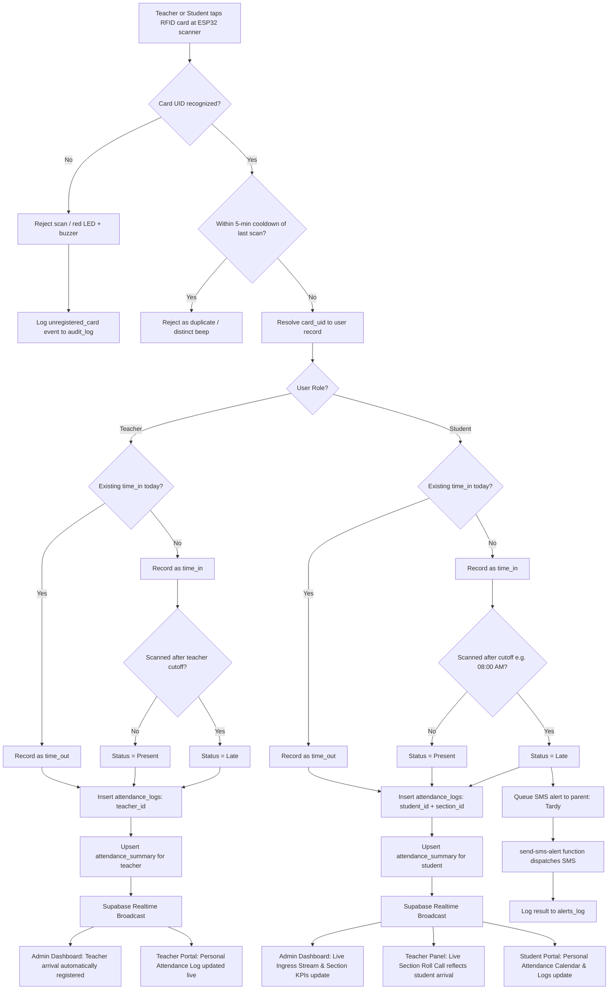
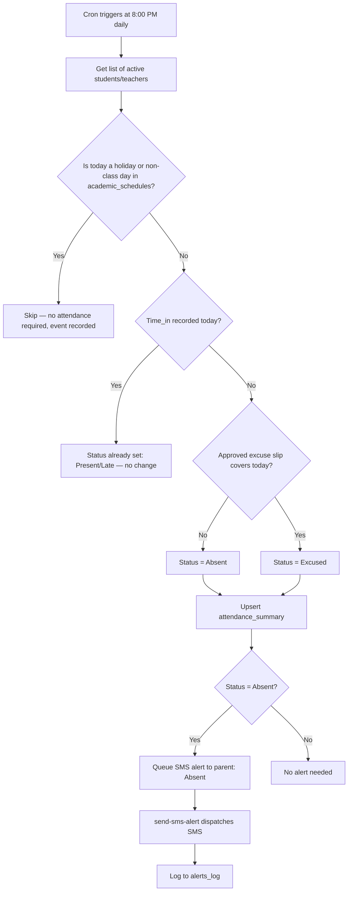
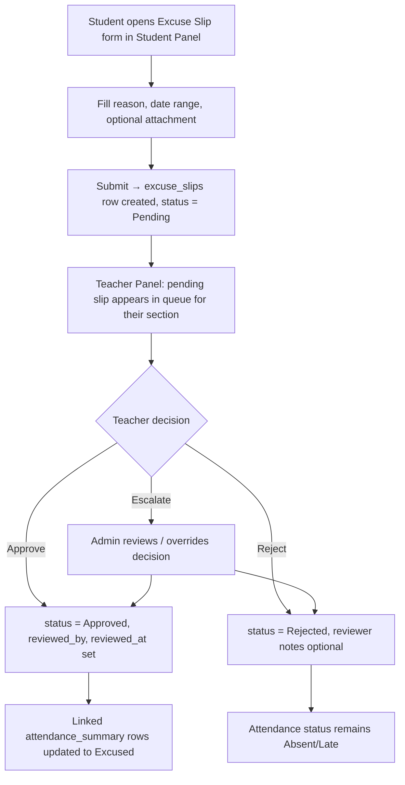
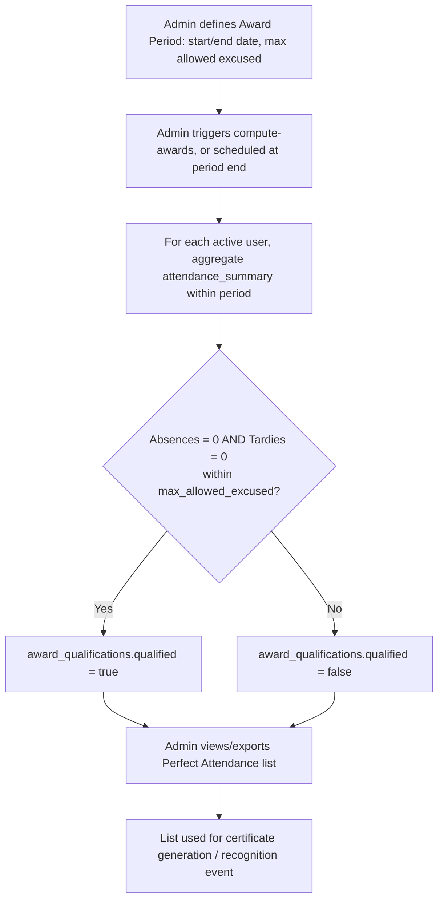
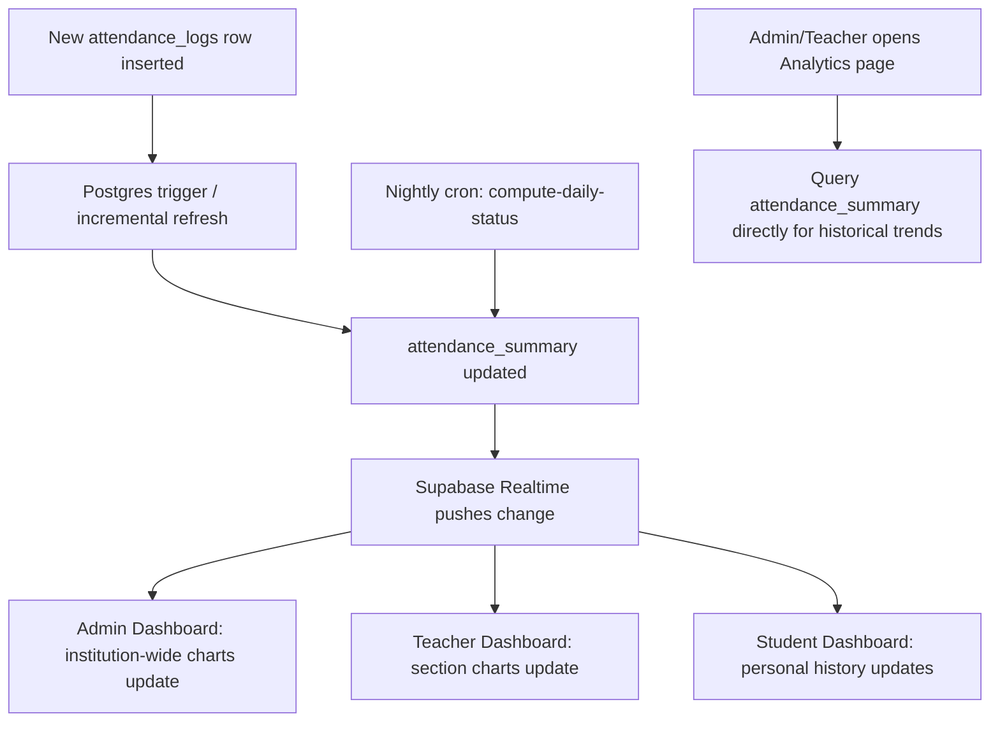
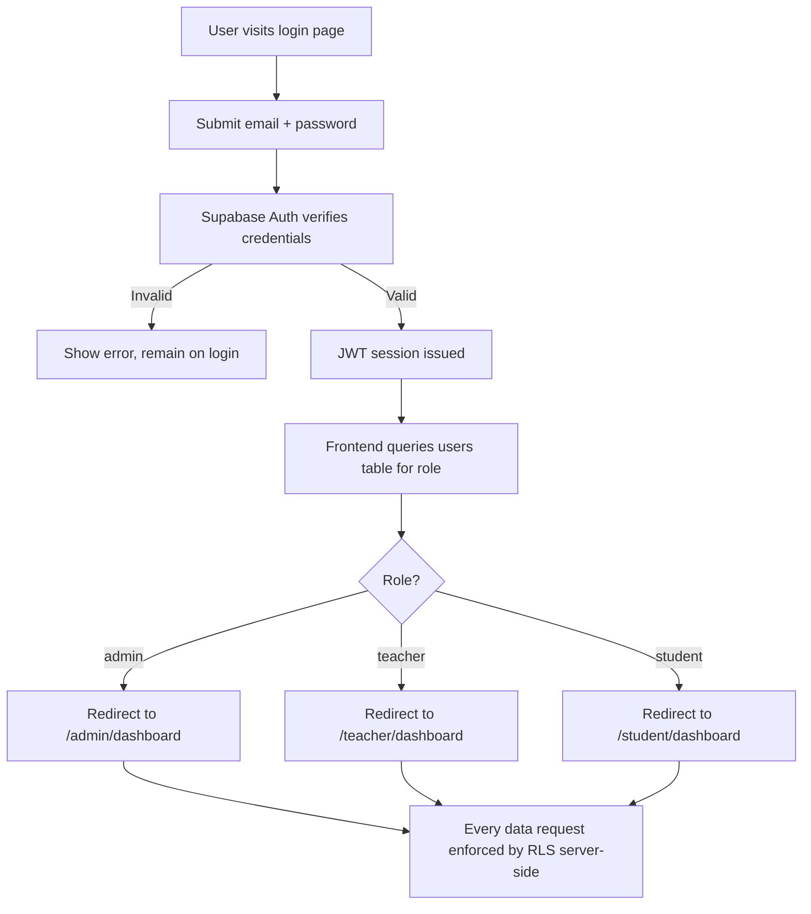

# System Workflow Document

## Attendance Monitoring System (AMS) — Bestlink College of the Philippines

**Companion to:** PRD.md, ARCHITECTURE.md, MODULE_WORKFLOWS.md, DB_E2E_WORKFLOW.md  
**Version:** 1.1  
**Date:** September 26, 2026  

---

## 1. Purpose

This document describes the operational workflows of the AMS — how data moves through the system for each core process, and how each RBAC role (Admin, Teacher, Student) interacts with it. Parents are included only as passive SMS recipients, consistent with the PRD.

* For the **module-by-module breakdown** across all 10 PRD functional requirements, see [`MODULE_WORKFLOWS.md`](MODULE_WORKFLOWS.md).
* For the **table-by-table end-to-end lifecycle** of a single attendance scan, see [`DB_E2E_WORKFLOW.md`](DB_E2E_WORKFLOW.md).

---

## 2. Core Workflow: RFID/QR Scan → Attendance Record (Teacher & Student)

This is the system's primary, highest-frequency workflow. The physical RFID hardware (ESP32 + RC522) provides unified ingress scanning for both **Students** and **Teachers**.



### 2.1 Role-Specific Portal Log & Calendar Access
Both teachers and students have dedicated access to attendance logs and monthly calendars in their respective portals:
* **Teacher Portal (`/teacher/`):**
  * **Personal Attendance Log & Calendar:** Teachers view their own check-in/time-out timestamps. On their Attendance Calendar, each day tile displays their resolved status (Present, Late, Absent, Excused) with specific **Time-In and Time-Out** times explicitly listed. Teachers also see all non-class days, holidays, and school events set by the Admin.
  * **Section Roll Call Log:** Teachers view real-time student taps for their assigned advisory/subject sections.
* **Student Portal (`/student/`):**
  * **Personal Attendance Timeline & Calendar:** Students track their daily resolved status (Present, Tardy, Absent, Excused) and institutional non-class days/events. Single Time-Out records are excluded to accommodate **Octoberian** and **Irregular** modular students taking multi-subject schedules throughout the day.
* **Admin Portal (`/admin/`):**
  * **Unified Attendance Logs & Calendar Management:** The Registrar monitors all scans across teachers and students, and manages the Academic Calendar (setting non-class days, legal holidays, weather suspensions, and school events). The Admin does not manually input attendance percentages on the calendar.

**Fallback path — QR scanning:** If RFID hardware is unavailable, the user opens the QR scan page (`/shared/qr-scan.html` or `/teacher/qr-attendance.html`), scans their personal QR code, and the same validation/cooldown/status logic applies, submitting to the same `scan-ingest` function with `scan_method = "qr"`.

**Fallback path — Manual marking:** If both RFID and QR are unavailable, the Teacher marks attendance manually from the Teacher Panel for their section. This bypasses `scan-ingest` and instead calls the `fn_manual_attendance_override` RPC directly (authenticated as the teacher, scoped by RLS to their own sections), which logs the override to `audit_log` with `created_by`.

---

## 3. Daily End-of-Day Workflow: Absence Classification & Alerts

Runs automatically every school night via the `compute-daily-status` cron function.



---

## 4. Excuse Slip Workflow



---

## 5. Perfect Attendance Award Workflow



---

## 6. Analytics Dashboard Data Refresh Workflow



---

## 7. CSV/Excel Export Workflow

```mermaid
flowchart TD
    A[User (Admin/Teacher) opens Reports page] --> B[Select filters: date range, section, status]
    B --> C[Query Supabase directly from browser, scoped by RLS]
    C --> D{Export format?}
    D -- CSV --> E[Generate CSV client-side]
    D -- Excel --> F[Generate .xlsx via SheetJS client-side]
    E --> G[Trigger browser download]
    F --> G
    G --> H[Log export_generated event to audit_log with filters used]
```

---

## 8. Role-Based Login & Panel Access Workflow



---

## 9. End-to-End Daily Operational Timeline (Narrative Summary)

| Time | Event |
| --- | --- |
| Before school starts | Admin/Teacher confirm scanner devices show `online` status on Admin Panel |
| Morning gate hours | Students tap RFID (or scan QR) at entrance → `time_in` recorded → Present/Late determined instantly → dashboards update in real time |
| Throughout the day | Teachers may manually mark attendance per period if needed; students may submit excuse slips for prior absences |
| Dismissal | Students tap out (`time_out`) if time-out tracking is enabled for the school |
| Ongoing | Teachers/Admin review and act on pending excuse slips |
| 8:00 PM (nightly cron) | System finalizes the day: any student/teacher with no time-in and no approved excuse slip is marked Absent; SMS alerts sent to parents for new Late/Absent statuses |
| Periodic (Admin-triggered or cron) | `compute-awards` runs at the end of a grading period/semester to update Perfect Attendance qualification list |
| As needed | Admin/Teacher generate CSV/Excel exports for reporting or compliance |

---

## 10. Error / Exception Handling Workflows

| Scenario | Handling |
| --- | --- |
| ESP32 loses Wi-Fi mid-day | Firmware buffers scans locally (LittleFS) and flushes queue on reconnect; device shows `offline` on Admin Panel until heartbeat resumes |
| Card UID not registered | Scan rejected, logged to `audit_log` as `unregistered_card`; Admin can review and link the card to a user from the Devices/Users page |
| Duplicate rapid scans | Rejected within the 5-minute cooldown window; no duplicate log created |
| SMS gateway failure | `alerts_log.status = failed`; Admin can view failed alerts and manually retry or resend from the Admin Panel |
| Teacher disputes an auto-marked Absence | Student/Parent-initiated excuse slip (submitted by student) reviewed by teacher; if approved, `attendance_summary` is corrected to Excused |
| Conflicting manual override vs. scan record | Manual overrides are logged with `created_by` in `audit_log`; the most recent authorized entry for that day/user takes precedence, and history remains visible to Admin for audit purposes |

---

## 11. Notes for Implementation

- All Mermaid diagrams above can be rendered directly in any Markdown viewer that supports Mermaid (e.g., GitHub, GitLab, most capstone documentation tools) or pasted into a diagramming tool for the capstone manuscript.
- These workflows map directly to the functional requirements in PRD.md (Section 4) and the technical contracts in ARCHITECTURE.md (Sections 5–8); use this document as the process-level reference during development and for the capstone's System Design/Methodology chapter.