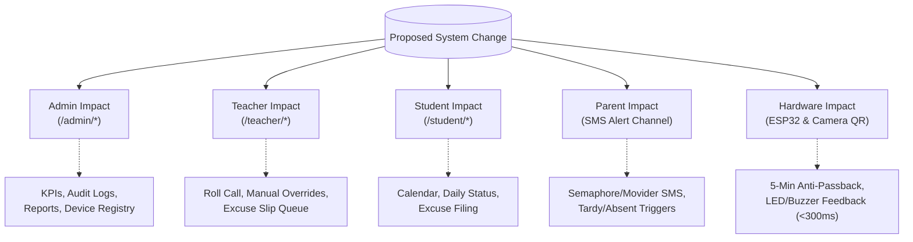

# Planning Skill Specification (`planning.md`)

## Attendance Monitoring System (AMS) — Bestlink College of the Philippines
**Subsystem of SMS 1 (School Management System)**  
**Target Path:** `docs/planning.md`  
**Version:** 1.0  
**Date:** September 26, 2026  
**Audience:** AI Coding Agents, Systems Architects, and Software Engineers  

---

## 1. Skill Purpose & Operational Mandate

The **AMS Planning Skill** defines the authoritative Standard Operating Procedure (SOP) for conceptualizing, analyzing, designing, and validating tasks within the **Bestlink College Attendance Monitoring System (AMS)** before writing executable code.

Whether operating in **VS Code + OpenCode** for high-level architectural planning or **Google Antigravity** for implementation, all agents and developers must execute this planning protocol to ensure academic rigor, architectural integrity, and zero regressions across the multi-role platform.

### 1.1 Core Directives
1. **Specification First:** Never write code, execute DDL migrations, or alter UI components without cross-referencing authoritative specifications in `docs/` (`PRD.md`, `ARCHITECTURE.md`, `DATA.md`, `WORKFLOW.md`, `MODULE_WORKFLOWS.md`, `DB_E2E_WORKFLOW.md`, `Security.md`, `UI-UX_Architecture.md`, `UI-UX_BackendSpec.md`).
2. **Defensive Blast Radius Assessment:** Every change in attendance capture, user status, or database schema has systemic ripple effects across Admin, Teacher, Student, Hardware, and Parent SMS layers. These impacts must be mapped before implementation.
3. **No Hallucinated Business Logic:** Do not invent institution-specific policies (e.g., cutoff times, excuse slip escalation ladders, SMS templates). Rely strictly on confirmed specs or prompt the user for clarification.
4. **Lightweight & Framework-Free Constraint:** Enforce the lightweight Vanilla JS (ES6+ modular) + Tailwind CSS + Supabase stack. Never propose React, Vue, Angular, Laravel, or full-stack SSR frameworks.
5. **Anti AI Slop:** Keep all code, plans, and technical blueprints lean, complete, and grounded. Reject bloated boilerplate, speculative abstractions, placeholder stubs (`TODO`), and trivial comments.
6. **No Emoji, Just Use an Icon Instead:** Strictly forbid emojis across UI elements, buttons, badges, notifications, and plans. Mandate crisp SVG vector icons styled via Tailwind CSS.

---

## 2. The 5-Phase Planning Protocol

Every non-trivial task (new feature, bug fix, schema modification, or hardware protocol update) must pass through these sequential phases:

```
┌─────────────────────────────────┐
│ Phase 1: Context Ingestion      │ ──► Read authoritative specs in docs/
└────────────────┬────────────────┘
                 │
┌────────────────▼────────────────┐
│ Phase 2: Multi-Role Impact Map  │ ──► Analyze Admin, Teacher, Student, Parent, ESP32
└────────────────┬────────────────┘
                 │
┌────────────────▼────────────────┐
│ Phase 3: Technical Blueprint    │ ──► DDL, RLS, PostgREST/RPC, UI Tokens, Edge Functions
└────────────────┬────────────────┘
                 │
┌────────────────▼────────────────┐
│ Phase 4: Edge Case & Security   │ ──► Anti-passback, offline kiosk, JWT claims, race conditions
└────────────────┬────────────────┘
                 │
┌────────────────▼────────────────┐
│ Phase 5: Incremental Execution  │ ──► Atomic diffs, zero regression, verification steps
└─────────────────────────────────┘
```

---

### Phase 1: Context Ingestion & Specification Discovery
Before planning, locate and inspect the relevant sections of documentation:

| Domain | Primary Authority | Secondary Authority |
|---|---|---|
| **System Scope & Goals** | `docs/PRD.md` | `docs/CONTEXT.md` |
| **System Boundaries & C4 Diagrams** | `docs/CONTEXT.md` | `docs/ARCHITECTURE.md` |
| **Database Schema, DDL & Types** | `docs/DATA.md` | `docs/ARCHITECTURE.md` (§4) |
| **High-Level Operational Workflows** | `docs/WORKFLOW.md` | `docs/PRD.md` (§4) |
| **Module-by-Module Workflows** | `docs/MODULE_WORKFLOWS.md` | `docs/PRD.md` (§4.1–§4.10) |
| **End-to-End Database Lifecycle** | `docs/DB_E2E_WORKFLOW.md` | `docs/DATA.md` |
| **Security Architecture, RLS & Ingress** | `docs/Security.md` | `docs/ARCHITECTURE.md` (§7) |
| **UI Design System, Palette & Layout**| `docs/UI-UX_Architecture.md`| `admin/dashboard.html` |
| **REST, RPC, Realtime & RLS Contracts**| `docs/UI-UX_BackendSpec.md` | `docs/ARCHITECTURE.md` (§5) |

---

### Phase 2: Multi-Role Impact Analysis
Map how the proposed change influences all four stakeholder personas and the hardware ecosystem:



#### Impact Matrix Checklist
- [ ] **Admin Portal:** Does this affect aggregated KPIs (`fn_get_daily_kpis`), audit logs, or device telemetry?
- [ ] **Teacher Portal:** Does this alter section roll call views, manual override permissions, or pending excuse slips?
- [ ] **Student Portal:** Does this alter monthly calendar status chips or personal attendance rate percentages?
- [ ] **Parent Channel:** Does this trigger immediate SMS alerts (tardiness) or end-of-day SMS alerts (absences)?
- [ ] **Hardware Gateway:** Does this impact ESP32 scan payload schemas, response latencies (<300ms), or anti-passback cooldowns?
- [ ] **Data Integrity:** Does this update `attendance_summary` or `attendance_logs`? Does it maintain soft deactivation (`status = 'inactive'`)?

---

### Phase 3: Technical Blueprint Formulation
Draft the concrete technical implementation plan covering all affected architectural tiers:

1. **Database Schema & DDL Modifications:**
   - Table name, column names, PostgreSQL data types, foreign key constraints (`on delete cascade`).
   - Appropriate indexes (e.g., `idx_attendance_student_date`).
   - RLS security policies using `auth.uid()` and role validation.
2. **Backend Services & Functions:**
   - RPC Stored Procedures (`security definer` functions with explicit role validation).
   - Supabase Edge Functions (Deno TypeScript endpoints with proper header authentication).
   - Realtime channel event broadcast definitions.
3. **Frontend Presentation & Design Tokens:**
   - Color Hunt Blue Palette compliance:
     - Royal Navy (`#0D47A1` / `--ch-900`): Primary headings & brand foundations.
     - Vibrant Blue (`#2196F3` / `--ch-500`): Interactive buttons, active nav, trend lines.
     - Sky Blue (`#90CAF9` / `--ch-200`): Card borders, target markers.
     - Ice Blue (`#E3F2FD` / `--ch-100`): Background canvas, icon badges, pill highlights.
   - Dual-theme token compatibility (`[data-theme="light"]` and `[data-theme="dark"]`).
   - Tabular numerals (`font-variant-numeric: tabular-nums`) on all counters and timestamps.
4. **Hardware & Peripheral Contracts:**
   - HTTPS POST `/functions/v1/scan-ingest` payloads.
   - `x-device-key` validation against hashed database keys.

---

### Phase 4: Edge Case & Security Auditing
Stress-test the plan against operational and security edge cases:

| Failure Mode / Edge Case | Expected System Mitigation |
|---|---|
| **Double Tap (Card bounce)** | Anti-passback filter rejects scans within 5 minutes (`429 Cooldown Active`). |
| **Unregistered Card Tap** | Optical red LED, buzzer alert, reject log written to `audit_log`, `404 Unregistered`. |
| **Network Dropout at Gate** | Web QR fallback kiosk stores scans in `IndexedDB: ams_offline_scans` and replays on reconnection. |
| **Direct Client API Tampering** | Postgres Row-Level Security (RLS) drops unauthorized requests even if frontend checks are bypassed. |
| **Teacher Reviewing Other Sections** | RLS policy restricts `excuse_slips` and `attendance_logs` to `teacher_sections` assignments. |
| **Parent Reply to SMS** | Asynchronous outgoing gateway only; carrier logs delivery status; incoming messages dropped or automated response sent. |
| **Holiday / Suspended Class Day** | `compute-daily-status` cron inspects `school_holidays` table and skips absence generation. |

---

### Phase 5: Incremental Execution Strategy
Follow these rules during code modification:
1. **Never Rewrite from Scratch:** Modify only the necessary functions or markup chunks.
2. **Defensive Rollbacks:** In frontend modules, implement optimistic UI updates with defensive state rollback on network failure.
3. **Verify Clean Syntax:** Inspect files post-edit to verify zero duplicate markup blocks, unclosed tags, or broken imports.

---

## 3. Standard Planning Template

When creating a formal implementation plan, copy and populate this Markdown template:

```markdown
# Implementation Plan: [Feature / Fix / Module Name]

## 1. Objective & Requirements Traceability
- **Goal:** [Concise description of the objective]
- **Target PRD Requirements:** [e.g., FR-1.1, FR-2.3, FR-5.2]
- **Target Roles:** [Admin | Teacher | Student | Parent]

## 2. Specification Review
- **Referenced Specs:** [e.g., docs/PRD.md §4.2, docs/UI-UX_BackendSpec.md §4]
- **Confirmed Constraints:** [e.g., Vanilla JS only, 5-minute cooldown, Color Hunt palette]

## 3. Multi-Role Impact Analysis
- **Admin:** [Describe UI/data impact or state 'None']
- **Teacher:** [Describe UI/data impact or state 'None']
- **Student:** [Describe UI/data impact or state 'None']
- **Parent (SMS):** [Describe alert trigger or state 'None']
- **Hardware (ESP32/QR):** [Describe protocol impact or state 'None']

## 4. Technical Blueprint
### A. Database (DDL & RLS)
```sql
-- DDL or RLS snippet here
```

### B. Backend Services & RPCs
- **Endpoint/Function:** [e.g., rpc/fn_review_excuse_slip]
- **Request / Response Payload:** [JSON format]

### C. Frontend / UI-UX
- **Files Modified:** [e.g., admin/dashboard.html, assets/js/pages/admin/overview.js]
- **Palette Tokens Used:** [--ch-900, --ch-500, --ch-200, --ch-100]
- **Micro-interactions:** [Count-up, pulse-dot, tabular-nums]

## 5. Defensive Edge Cases & Mitigations
1. [Edge Case 1] → [Mitigation]
2. [Edge Case 2] → [Mitigation]

## 6. Step-by-Step Execution Plan
1. [ ] Step 1: Create/modify database migration in supabase/migrations/
2. [ ] Step 2: Implement Edge function or RPC
3. [ ] Step 3: Implement modular JavaScript API service in assets/js/api/
4. [ ] Step 4: Update UI view and wire components
5. [ ] Step 5: Verification & regression testing
```

---

## 4. System Implementation Milestones & Roadmap

AI agents and developers should structure work packages according to the official system milestone roadmap:

```
MILESTONE 1 ────────► MILESTONE 2 ────────► MILESTONE 3 ────────► MILESTONE 4 ────────► MILESTONE 5
Core Database &       ESP32 Hardware &      Role Portals &        Daily Crons &         BI Analytics &
RLS Foundations       Scan Ingestion        Realtime Sync         Parent SMS Alerts     Awards Engine
```

### Milestone 1: Database Foundation & Security Architecture
* Execute Supabase DDL migrations for `users`, `sections`, `rfid_cards`, `qr_codes`, `scan_devices`, `attendance_logs`, `attendance_summary`, `excuse_slips`, and `parent_contacts`.
* Implement strict Postgres Row-Level Security (RLS) policies for each authenticated role.
* Seed development database with representative sections (BSIT, BSCS) and test credentials.

### Milestone 2: Hardware Ingress & Edge Ingestion Pipeline
* Develop `/functions/v1/scan-ingest` Supabase Edge Function with device authentication (`x-device-key`) and 5-minute anti-passback cooldown.
* Deploy ESP32 firmware (`ams_scanner.ino`) with MFRC522 integration, optical LED drivers, and piezo buzzer audio feedback (<300ms).
* Build camera-based QR fallback scanner (`/shared/qr-scan.html`) with client-side `jsQR` decoding and offline `IndexedDB` caching.

### Milestone 3: Role-Based Web Portals & Realtime Feeds
* Admin Portal: Overview dashboard with live scan feed (`channel('attendance_logs')`), 5-week trend charts, device manager, and logs inspector.
* Teacher Portal: Section roll call view, manual fallback marking (`fn_manual_attendance_override`), and excuse slip queue.
* Student Portal: Color-coded monthly attendance calendar, scan history, and excuse slip submission form with file upload to Supabase Storage (`excuse-attachments`).
* Apply Color Hunt Blue Palette (`#0D47A1`, `#2196F3`, `#90CAF9`, `#E3F2FD`) and dual-theme switching across all views.

### Milestone 4: Automated Crons & Parent SMS Notification Gateway
* Develop `/functions/v1/compute-daily-status` scheduled cron (8:00 PM nightly) to automatically evaluate daily absences while respecting school holidays.
* Develop `/functions/v1/send-sms-alert` integrating SMS Gateway (Semaphore/Movider) to deliver real-time tardiness and end-of-day absence notices to parents.
* Implement `alerts_log` audit trail and SMS template manager in Admin settings.

### Milestone 5: Executive Analytics & Perfect Attendance Award Engine
* Implement Stored Procedures (`fn_get_daily_kpis`, `fn_get_5week_trend`, `fn_get_sections_to_watch`).
* Build Perfect Attendance qualification engine (`compute-awards`) evaluating continuous zero-absence, zero-tardy records within configurable excused limits.
* Build printable vector certificate generator and CSV/Excel streaming export module.
